# Azure Blockchain Workbench Release Notes - Version 1.8.1

Thank you all for your continued support and interest in Azure Blockchain Workbench. We’re excited to announce the release of Workbench 1.8.1, in which we have resolved all the accessibility bugs, Azure Blockchain Workbench is now fully compliant with accessibility. We have also fixed a bug in the scripts that is used to connect AAD to your Workbench to support some breaking changes in the azure cloud shell. You can deploy a new instance of Workbench through the Azure Portal or upgrade your existing deployments to 1.8.1 using our [upgrade script](https://github.com/Azure-Samples/blockchain/tree/master/blockchain-workbench/scripts/upgrade/readme.md).

# Azure Blockchain Workbench Release Notes - Version 1.8.0

Thank you all for your continued support and interest in Azure Blockchain Workbench. We’re excited to announce the release of Workbench 1.8.0, in which we have made component improvements and added availability in more Azure Regions.

This update includes the following improvements:

## Additional Regions Available for Workbench Deployments

We have expanded our regional support for Azure Blockchain Workbench for our customers across the globe. With version 1.8.0, you will see additional regional deployment options of North Europe, West US 2, and Japan East. Now, when deploying Azure Blockchain Workbench, you can select from a total of six regions.

 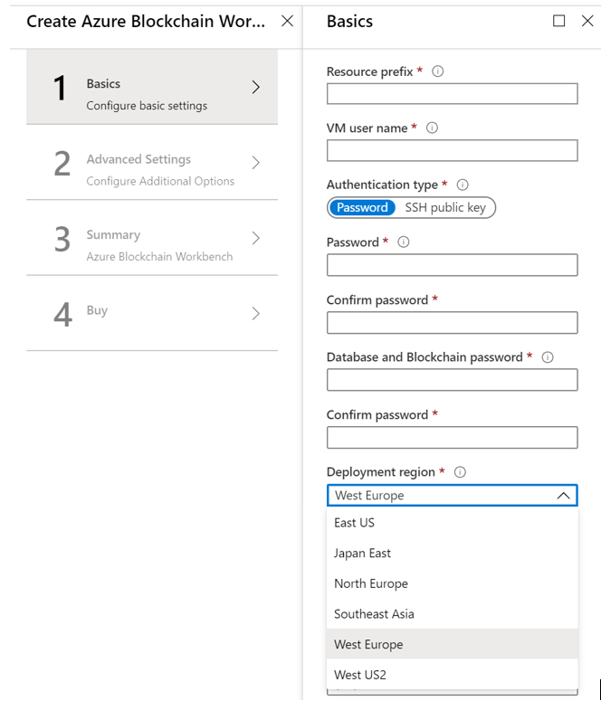

For customers who would like to deploy a new Azure Blockchain Service member from directly in the Azure Blockchain Workbench deployment experience, the member will also sit in the selected region.

## Upgraded Solidity Compiler to 0.5.10

One of the highly requested features that we’ve heard from customers is upgrading the Solidity compiler to the latest version, especially with some of the recent updates to Solidity. With Workbench 1.8.0, the solidity compiler is now upgraded to version 0.5.10.

Note that if you deploy new applications in Workbench, uploading older smart contracts may result in error messages saying a different compiler version is required. Since there are breaking changes from the 0.4 compiler version to the 0.5 complier version, you will need to update your smart contract to account for these changes.

You can stay up to date on Azure Blockchain by following us on Twitter @MSFTBlockchain. Please use our [Blockchain User Voice](https://aka.ms/blockchainuservoice) to provide feedback and suggest features/ideas for Workbench. Your input is helping make this a great service.  We look forward to hearing from you.

# Azure Blockchain Workbench Release Notes - Version 1.7.0

## Integration with Azure Blockchain Service

With the Azure Blockchain Service now in public preview, you can develop directly with Workbench on Azure Blockchain Service as the underlying blockchain. For those of you who have been on this blockchain journey with us, there are now templates in Azure which make it faster to configure and deploy a private blockchain network, but it’s still up to you to maintain and run your blockchain nodes, including upgrading to new versions, installing security patches, and more. Azure Blockchain Service simplifies the maintenance of the underlying blockchain network by running a fully managed blockchain node for you.

 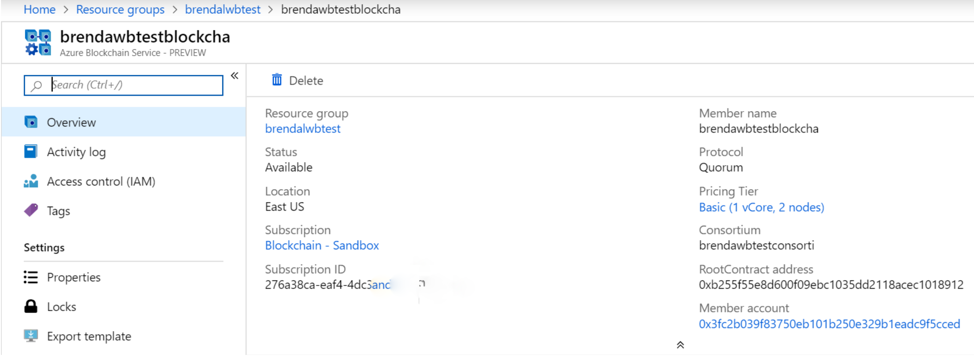

Workbench helps with building the scaffolding needed on top of a blockchain network to quickly iterate and develop blockchain solutions. Workbench 1.7.0 enables you to easily deploy the Azure Blockchain Service directly with Workbench. Deploy Workbench from the Azure Marketplace, and in the Advanced Settings blade – select “Create New” Blockchain Network under Blockchain Settings.

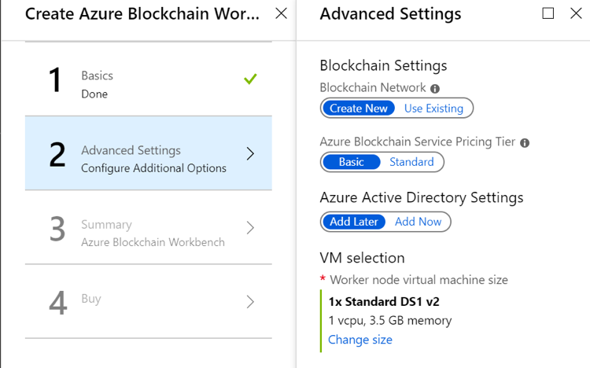

Selecting this option will automatically deploy an Azure Blockchain Service node for you.

> Note that if you  rotate the primary API key on your primary transaction node on your Azure Blockchain Service, you need to change the key of the configured RPC endpoint on Workbench. Update the Key Vault with the new key and reboot the VMs. 

## Enhanced Compatibility with Quorum

One of the highly requested features that we’ve heard from customers is adding compatibility for additional blockchain network protocols. In previous releases of Workbench, the default blockchain network that is configured is an Ethereum Proof-of-Authority (PoA) blockchain network. With Workbench 1.7.0, we have added compatibility with the Quorum blockchain network.

For customers who are looking to build blockchain applications on top of Quorum, you can now develop and build your Quorum based applications directly with Workbench.

# Azure Blockchain Workbench Release Notes - Version 1.6.0

## Application versioning
One of the most popular feature requests from you all has been that you would like to have an easy way to manage and version your Workbench applications instead of having to manually change and update your applications as you are in the development process.
We’ve continued to improve the Workbench development story with support for application versioning with 1.6.0 via the web app as well as the REST API. You can upload new versions directly from the web application by clicking “Add version.” Note that if you have any changes in the application role name, the role assignment will not be carried over to the new version.

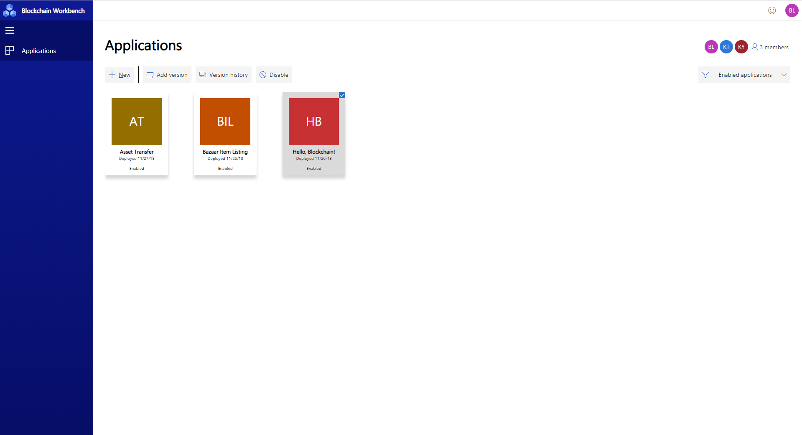

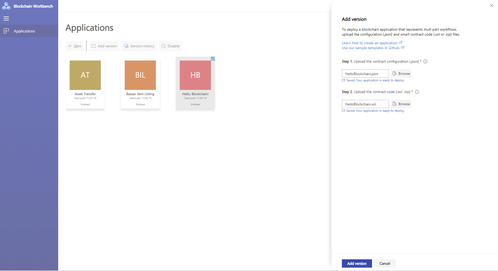

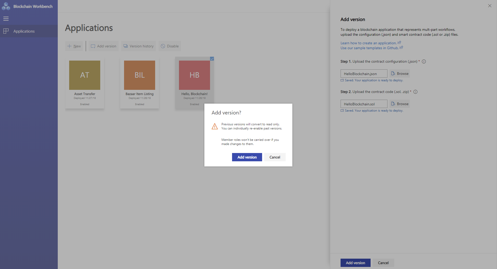

You can also view the application version history. To view and access older versions, select the application and click “version history” in the command bar. Note, that as of now by default older versions are read only. If you would like to interact with older versions, you can explicitly enable the previous versions.

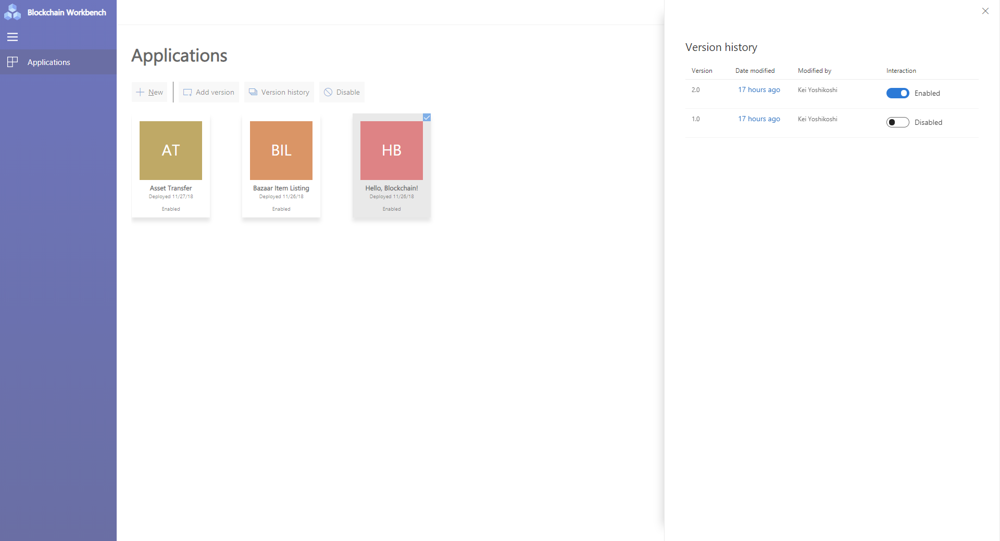

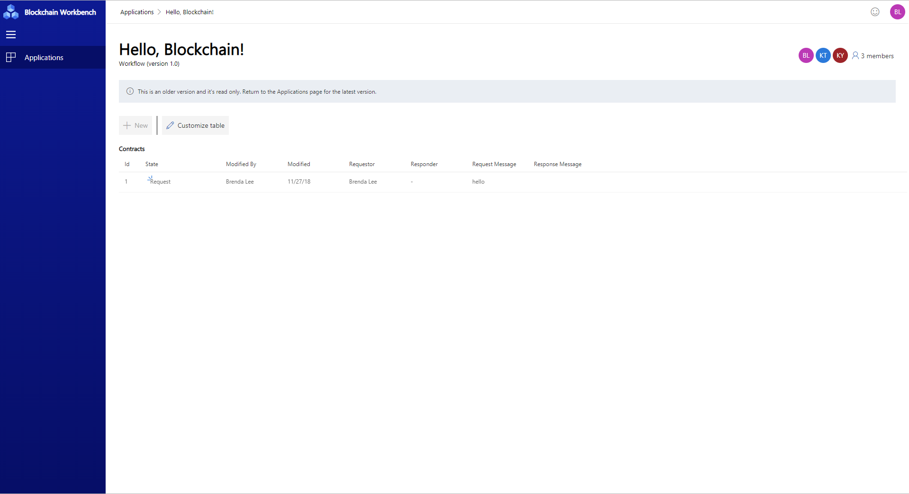


## New egress messaging API

Workbench provides many integration and extension points, including via a REST API and a messaging API. The REST API provides developers a way to integrate to blockchain applications. The messaging API is designed for system to system integrations.
In our previous release, we enabled more scenarios with a new input messaging API. In 1.6.0, we have implemented an enhanced and updated output messaging API which publishes blockchain events via Azure Event Grid and Azure Service Bus. This enables downstream consumers to take actions based on these events and messages such as, sending email notifications when there are updates on relevant contracts on the blockchain, or triggering events in existing enterprise resource planning (ERP) systems.
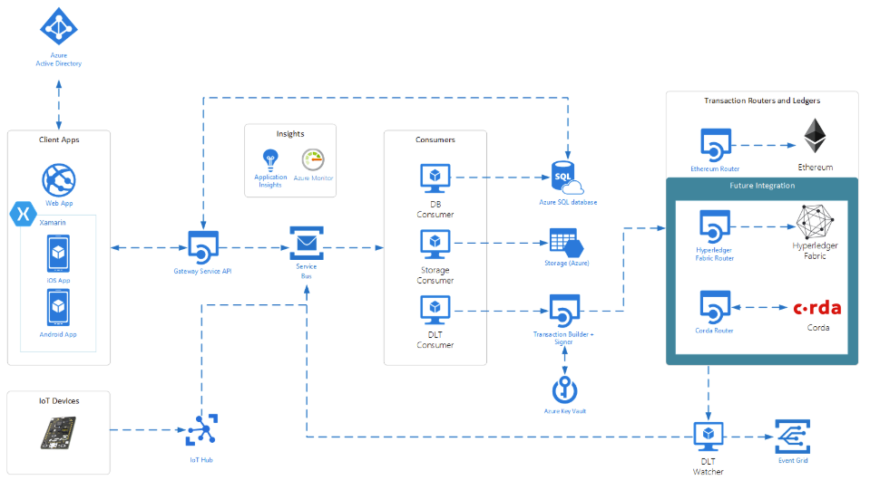

Here is an example of a contract information message with the new output messaging API. You’ll get the information about the block, a list of modifying transactions for the contract, as well as information about the contract itself such as contract ID and contract properties. You also get information on whether or not the contract was newly created or if a contract update occurred.

```
{
     "blockId": 123,
     "blockhash": "0x03a39411e25e25b47d0ec6433b73b488554a4a5f6b1a253e0ac8a200d13f70e3",
     "modifyingTransactions": [
         {
             "transactionId": 234,
             "transactionHash": "0x5c1fddea83bf19d719e52a935ec8620437a0a6bdaa00ecb7c3d852cf92e18bdd",
             "from": "0xd85e7262dd96f3b8a48a8aaf3dcdda90f60dadb1",
             "to": "0xf8559473b3c7197d59212b401f5a9f07b4299e29"
         },
         {
             "transactionId": 235,
             "transactionHash": "0xa4d9c95b581f299e41b8cc193dd742ef5a1d3a4ddf97bd11b80d123fec27506e",
             "from": "0xd85e7262dd96f3b8a48a8aaf3dcdda90f60dadb1",
             "to": "0xf8559473b3c7197d59212b401f5a9f07b4299e29"
         }
     ],
     "contractId": 111,
     "contractLedgerIdentifier": "0xf8559473b3c7197d59212b401f5a9f07b4299e29",
     "contractProperties": [
         {
             "workflowPropertyId": 1,
             "name": "State",
             "value": "0"
         },
         {
             "workflowPropertyId": 2,
             "name": "Description",
             "value": "1969 Dodge Charger"
         },
         {
             "workflowPropertyId": 3,
             "name": "AskingPrice",
             "value": "30000"
         },
         {
             "workflowPropertyId": 4,
             "name": "OfferPrice",
             "value": "0"
         },
         {
             "workflowPropertyId": 5,
             "name": "InstanceOwner",
             "value": "0x9a8DDaCa9B7488683A4d62d0817E965E8f248398"
         },
     ],
     "isNewContract": false,
     "connectionId": 1,
     "messageSchemaVersion": "1.0.0",
     "messageName": "ContractMessage",
     "additionalInformation": {}
}
```

Read more about the newly designed messaging API in our [documentation](https://docs.microsoft.com/en-us/azure/blockchain/workbench/messages-overview). Note that this redesign of the output messaging model will impact existing integrations you have done.

## WorkbenchBase class is no longer needed in contract code

For customers who have been using Workbench, you will know that there is a specific class that you need to include in your contract code, called WorkbenchBase. This class enabled Workbench to create and update your specified contract. When developing custom Workbench applications, you would also have to call functions defined in the WorkbenchBase class to notify Workbench that a contract had been created or updated.
With 1.6.0, this code serving the same purpose as WorkbenchBase will now be autogenerated for you when you upload your contract code. You will now have a more simplified experience when developing custom Workbench applications and will no longer have bugs or validation errors related to using WorkbenchBase. See our updated samples, which have WorkbenchBase removed.
This means that you no longer need to include the WorkbenchBase class nor any of the contract update and contract created functions defined in the class. To update your older Workbench applications to support this new version, you will need to change a few items in your contract code files:
* Remove the WorkbenchBase class.
* Remove calls to functions defined in the WorkbenchBase class (ContractCreated and ContractUpdated).
If you upload an application with WorkbenchBase included, you will get a validation error and will not be able to successfully upload until it is removed. For customers upgrading to 1.6.0 from an earlier version, your existing Workbench applications will be upgraded automatically for you. Once you start uploading new versions, they will need to be in the 1.6.0 format.

## Get available updates directly from within Workbench

Whenever a Workbench update is released, we announce the updates via the Azure blog and post release notes in our [GitHub](https://aka.ms/blockchainsdkgithub). If you’re not actively monitoring these announcements, it can be difficult to figure out whether or not you are on the latest version of Workbench. You might be running into issues while developing which have already been fixed by our team with the latest release.
We have now added the capability to view information for the latest updates directly within the Workbench UI. If there is an update available, you will be able to view the changes available in the newest release and update directly from the UI.
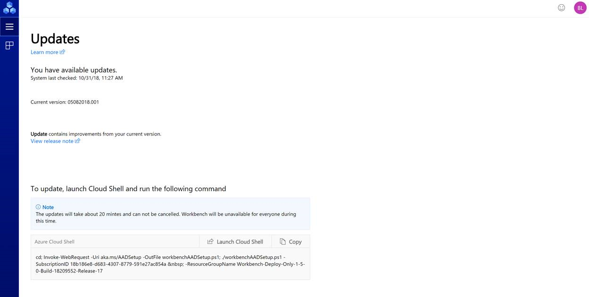

## Breaking Changes in 1.6.0

1. **WorkbenchBase related code generation:** Before 1.6.0, the WorkbenchBase class was needed because it defined events indicating creation and update of Blockchain Workbench contracts. With this change, you no longer need to include it in your contract code file, as Workbench will automatically generate the code for you. Note that contracts containing WorkbenchBase in the Solidity code will be rejected when uploaded.

2. **Updated outbound messaging API:** The new schema will impact the existing integration work you have done with the current messaging API. If you want to use the new messaging API you will need to update your integration specific code.

    The name of the service bus queues and topics has been changed in this release. Any code that points to the service bus will need to be updated to work with Workbench version 1.6.0.
    * ingressQueue - the input queue on which request messages arrive
    * egressTopic     - the output queue on which update and information messages are sent

3. **Workbench application sample udpates:** All Workbench applications sample code are updated since we no longer need the WorkbenchBase class in contract code. If you are on an older version of Workbench and use the samples on GitHub, or vice versa, you will see errors. Upgrade to the latest version of Workbench if you want to use samples.


# Azure Blockchain Workbench Release Notes - Version 1.5.0
This release contains changes in the following areas:
- Simplified deployment experience – one required setup section with optional advanced settings
- Semi automated post deployment Azure Active Directory setup option
- New and improved ingress messaging API
- More detailed logging and error handling

Breaking changes in this release:
- Existing integration with ingress messaging API will need to be rewritten
- Existing smart contract code will have warnings at upload time if not aligned with latest version of Solidity
- AAD Application registration needs to be updated

## Simplified deployment and setup

We have made it easier to get started with Workbench. In previous versions of Workbench, there were many prerequisite steps that you need to take before deploying Workbench to properly set up integration with your Azure Active Directory (AAD) tenant. You also had to step through other setup blades in the Azure Portal to set up your Blockchain Network and Monitoring options.

With version 1.5.0, only the Basic Settings blade is required for you to fill out to setup Workbench. The Advanced Settings is now optional, so you can get started with your deployment even faster. If you want to do more advanced setup like connecting to an existing blockchain network, setting up your AAD tenant, and selecting a specialized VM size, those options are still available to you in the Advanced Settings blade.

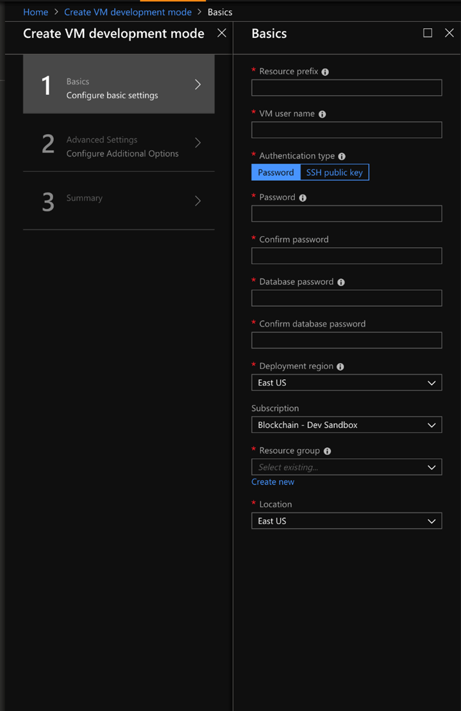

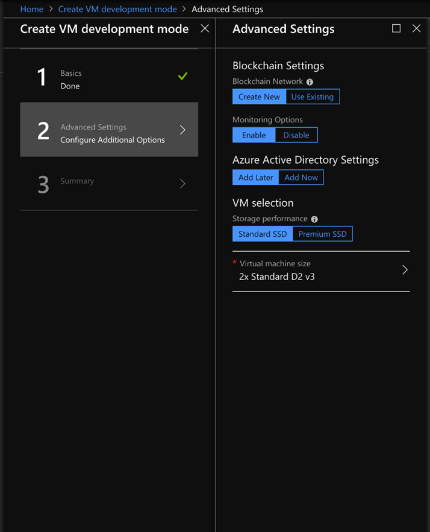

## More flexibility and easier AAD integration

We’ve also done a lot around the AAD integration to give you more options when choosing which tenant to connect to Workbench with. Before, there were a handful of administrator permissions that you had to have in order to set up the integration properly. We have updated the integration to reduce these requirements – you can now connect Workbench with a tenant where you are not an admin, so you no longer need to setup an entirely new tenant for Workbench.

The AAD setup experience has also been simplified dramatically by allowing you to set up your AAD integration after Workbench has successfully deployed. Simply select the “Add Later” option in the Advanced Settings tab.

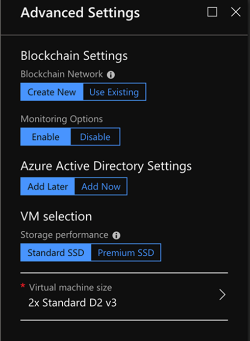

If you already have your AAD and application setup, you still have the option to set that up during deployment time. Note that we have simplified the AAD setup and you no longer need to provide an application key.

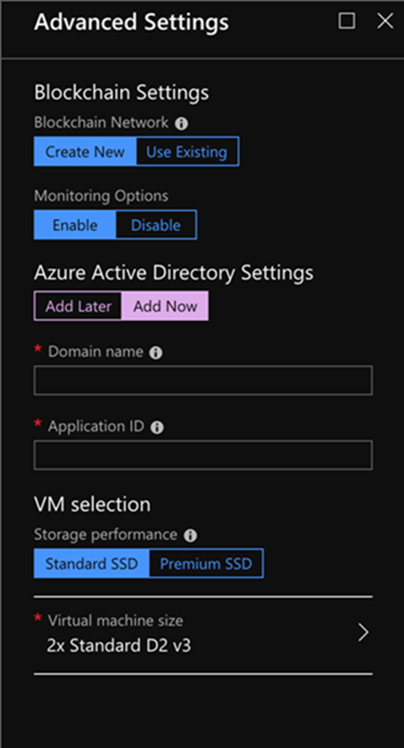

Note: If you are using an old AAD Application Registration, you will need to update your AAD Application by following these [instructions](https://aka.ms/workbenchaadsteps).

After Workbench is deployed, you will see a new setup page after navigating to the web app. Here, you’ll be able to run a script our team provides to do automated setup for you.

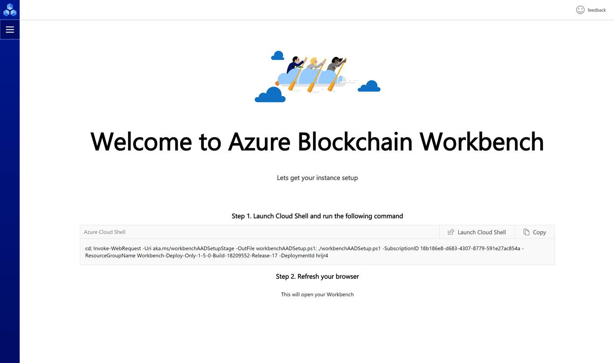

The script does all the prerequisite AAD related setup steps for you (guide on manual steps [here](https://aka.ms/workbenchAADsteps)):

	1. Creates and registers a new application registration.
	2. Modifies the application manifest to include the Workbench Administrator application role.
	3. Adds the required Graph API permissions to read basic user profiles.

## New input messaging API

Workbench provides a number of integration points out of the box, including via a REST API and a messaging API. The REST API provides developers a way to integrate to blockchain applications. For example, you can use the REST API and Power BI to create visualizations based on blockchain data.

The messaging API is designed for system to system integrations. Currently, Workbench publishes blockchain events via Azure Event Grid and Azure Service Bus, which enables downstream consumers to take action based on these events and messages.

Based on your feedback, we have improved and expanded to accommodate more scenarios with a newly designed input messaging API. This allows external systems to initiate transactions to create users, create contracts, and update contracts on a ledger.  Developers have continued to express interest in sending input via the Workbench messaging API to accomplish the scenarios above. With 1.5.0, we have designed an input messaging API to unlock even more system to system integration scenarios.

Here is an example of a contract creation request with the new input messaging API. You need to provide details of the contract that you’d like to create, including the application, workflow, and parameter details, as well as information about the blockchain and other metadata such as the schema version and the type of message that is being sent.

			```

			{
			    "requestId": "ce3c429b-a091-4baa-b29b-5b576162b211",
			    "userChainIdentifier": "0x9a8DDaCa9B7488683A4d62d0817E965E8f248398",
			    "applicationName": "AssetTransfer",
			    "workflowName": "AssetTransfer",
			    "parameters": [
			        {
			            "name": "description",
			            "value": "a 1969 dodge charger"
			        },
			        {
			            "name": "price",
			            "value": "12345"
			        }
			    ],
			    "connectionId": 1,
			    "messageSchemaVersion": "1.0.0",
			    "messageName": "CreateContractRequest"
			}

			```
 
You will get an update message based on the status of the request. Here’s a corresponding example of a contract creation update for the above contract creation request.

			```

			{
			    "requestId": "ce3c429b-a091-4baa-b29b-5b576162b211",
			    "contractId": 55,
			    "contractLedgerIdentifier": null,
			    "connectionId": 1,
			    "messageSchemaVersion": "1.0.0",
			    "messageName": "CreateContractUpdate",
			    "status": "Failure"
			    "additionalInformation": {
			        "errorCode": 4000,
			        "errorMessage": "Contract cannot be provisioned on connection."
			    }
			}

			```
 
You get the contract ID of the contract that was just created, metadata around the blockchain and message, as well as some additional information based on the status of the request update.

In the upcoming months, we will also be redesigning and enhancing the output messaging model, which may impact some of the existing work you have done. You can read more about the newly designed messaging API  [here](https://docs.microsoft.com/en-us/azure/blockchain/workbench/messages-overview).

## More robust transaction submission pipeline

One of the biggest improvements we’ve made in 1.5.0 is a new and improved submission pipeline. Many of you have told us that you’ve wanted better telemetry and more precise error handling in the web app to quickly troubleshoot issues.

#### Error handling in the UX
Based on our rewrite of the submission pipeline, you will notice a significant improvement in stability and get more detailed error messages when transactions fail. You will now see two additional types of error messages surfaced.


- *The action failed. Please check your input or code and try again. Your administrator can use RequestId to look up details in Application Insights.* One of the additions you will see is that we now provide a request ID with a failed action. This allows you to look up the failure details in Application Insights, enabling a better troubleshooting experience.
	 
- *There are no events identified from this action. Please update your code to add an event for this action and try again.* You may see this error when you are expecting to see some update in the Workbench UI but nothing shows up. This is because there are no Workbench events identified from the action that was taken, and you will be prompted to update your contract code. To mitigate this issue, double check that you have called the ContractUpdated() or ContractCreated() function properly. You can read more about writing blockchain apps for Workbench [here](https://docs.microsoft.com/en-us/azure/blockchain/workbench/create-app).

#### Logging and Telemetry
We have included better logging and telemetry to help with troubleshooting. Each Workbench instance has a corresponding Application Insights instance, where you can find logs to trace each request through the different Workbench components and services. You can find a step by step guide on how to do this on our [FAQ](https://aka.ms/workbenchFAQ) page.

## Breaking Changes in 1.5.0

1. **Updated ingress messaging API:** Due to the new and improved design for the ingress messaging API, you will need to update your existing integration code. We have renamed the service bus queues and topics.
	* ingressQueue - the input queue on which request messages arrive
	* egressTopic     - the output queue on which update and information messages are sent
2. **Workbench application sample updates:** Since we have updated the solidity compiler to the latest version, all Workbench application samples code will be updated as well. So, if you are on an older version of Workbench and want to use samples, you will see warnings or errors when the samples that we have on Github are uploaded. Upgrade to the latest version of Workbench if you want to use samples.
3. **Workbench application checker:** There have been additional verifications introduced which may surface additional errors or warnings to your existing contract code.
	* ContractUpdated verification: If the ContractUpdated call has a parameter that is either (a) not a workflow function, or (b) is different from the caller workflow function, you will get an error.
	* Configuration and smart contract function verification: If the function in smart contract doesn’t exist or function signature is different (parameter names do not match), you will get a more descriptive error.

## Upcoming Breaking Changes

We appreciate your continued interest in Workbench. We have a few upcoming features which may impact you.
1. **WorkbenchBase code generation:** The WorkbenchBase class is required for writing Blockchain Workbench specific apps, as it enables Blockchain Workbench to create and update contracts. With this upcoming change, you no longer need to include it in your contract code file, as Workbench will automatically generate the code for you. If you continue to include WorkbenchBase in your smart contracts, it will not upload successfully after 1.6.0.
2. **Updated outbound messaging API:** Workbench has a messaging API for system to system integrations. We have had an outbound messaging API which we will be redesigning. The new schema will impact the existing integration work you have done with the current messaging API. If you want to use the new messaging API you will need to update your integration specific code.


# Azure Blockchain Workbench Release Notes - Version 1.4.0
To use 1.4, you can either deploy a new instance of Workbench through the Azure Portal or upgrade your existing deployment to 1.3.0 using our upgrade script. This update includes the following improvements:

## Better accessibility for screen readers and keyboard navigation

Azure Blockchain Workbench is far more than UI within client apps. Workbench provides a rich developer scaffold for you to develop and integrate blockchain solutions within your enterprise.


For this release, we focused on making Workbench more accessible for everyone. Accessibility is a key pillar in our vision of empowering every person and every organization to achieve more, and we’re excited to share some of the improvements we’ve made with accessibility in mind. The Web client gives you an easy to use environment to validate, test, and view blockchain applications. The application interface is dynamically generated based on smart contract metadata and can accommodate any use case. The client application delivers a user-facing front end to the complete blockchain applications generated by Blockchain Workbench.
With version 1.4.0, the Web client now fully supports screen readers in terms of navigation and reading information. In addition, we updated the Web client to better support keyboard shortcuts and navigation. We hope these improvements can make you more productive when creating blockchain applications in Workbench.

## Customization of smart contract table columns

Workbench dynamically creates Web client UI based on your smart contracts and application configuration. Workbench summarizes smart contract instances as a table in the Web client based on the properties specified in the application configuration. Depending on the blockchain scenario, developers may specify a lot of properties for any given application. Unfortunately, if many properties are specified, the smart contract table within the Web client UI will become hard to read due to the size and number of columns of the table (see below image).
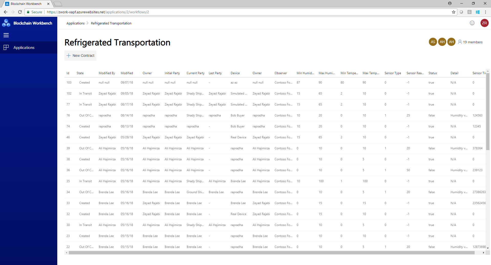

In some cases, properties may be more useful from a reporting perspective rather than a user experience perspective. To help with readability of the smart contract tables, we’ve introduced a new feature, which allows users to customize the smart contract table in terms of visible columns and order of columns.
Below is a screenshot of the customize table pane, which allows each user to toggle the visibility of table columns as well as adjust the ordering of columns within the table.


The smart contract table view will reflect all changes applied via the customize table pane.
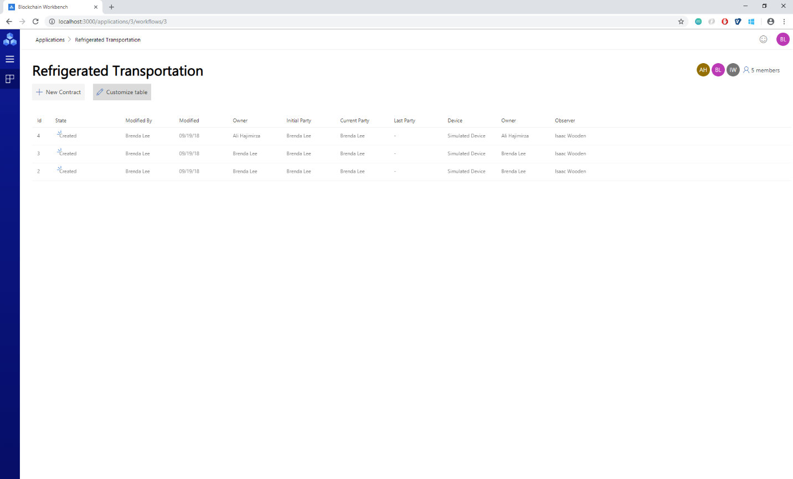

## New supported datatype - Arrays

With 1.4.0, we now support array datatypes as part of constructor and function parameters as well as smart contract properties. Arrays allow you to create blockchain apps where you can input and represent a strongly typed list of content, such as a list of numbers or values.
Workbench currently supports static and dynamic arrays of integers, Booleans, money, and time. Workbench does not yet support array of enums or array of arrays, including strings. Note, for string support we’re waiting for Solidity functionality to get out of preview. Let us know if these limitations are blockers for you.
The array type is specified via the configuration file as follows:
			```

			"Properties": [
			{
			  {
				"Name": "PropertyType",
				"DisplayName": "Property Type",
				"Type": {
				"Name": "array",
				  "ElementType": {
				     "Name": "int"
				  }
				}
			  }
			},

			```
 
There is a limitation is Solidity when it comes to public properties related to arrays. If you have a public state variable of an array type, Solidity only allows you to retrieve single elements of the array with auto-generated getter functions. To work around this limitation, you will need to provide an appropriate function to return arrays. For example:

			```

			function GetPropertyTypes() public constant returns (int[]) {
			     return PropertyType;
			}

			```
 
If this function is not part of your Solidity code, we will show an error when uploading your blockchain application.

## Support for strings up to 4k characters

One of the limitations in Workbench is the data type strings can only be 256 characters. We’ve received feedback from folks who wanted us to increase the limit. With 1.4.0, the new limit is 4000 characters. Note, using more characters will result in using more gas when processing transactions. When building your smart contracts, please be aware of the block gas limit and build your smart contracts with that limit in mind.
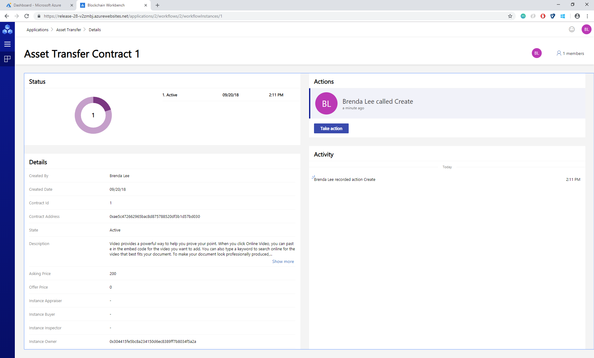


## Faster and more reliable transaction processing

With 1.4.0, we’ve made additional reliability improvements to the DLT Watcher microservice (see the [Blockchain Workbench architecture document](https://docs.microsoft.com/en-us/azure/blockchain-workbench/blockchain-workbench-architecture) for more information on this component). The Watcher has been rewritten and is able to process blocks at a much faster rate.

Please use our [Blockchain User Voice](https://aka.ms/blockchainuservoice) to provide feedback and suggest features/ideas for Workbench. Your input is helping make this a great service.  We look forward to hearing from you.


# Azure Blockchain Workbench Release Notes - Version 1.3.0

## Faster and more reliable deployment

We look at telemetry every day to identify issues that affect our customers, and as a result made some changes to make deploying Workbench not only more reliable, but faster as well.

## Better transaction reliability

Continuing from the [monitoring improvements](https://azure.microsoft.com/en-us/blog/azure-blockchain-workbench-1-1-0-extends-capabilities-and-monitoring/) we made as part of 1.1.0, we’ve made reliability improvements to the DLT Watcher and DLT Consumer microservices (see the [Blockchain Workbench architecture document](https://docs.microsoft.com/en-us/azure/blockchain-workbench/blockchain-workbench-architecture) for more information on those components). Practically speaking, you’ll notice fewer errors saying “It looks like something went wrong…”.


## Ability to deploy Workbench in a multi-member Ethereum PoA consortium

With [release 1.2.0](https://azure.microsoft.com/en-us/blog/top-feature-requests-added-with-azure-blockchain-workbench-1-2-0/) you could deploy Workbench and connect that deployment to an existing Ethereum-based network. This past week we announced the availability of a [new standalone Ethereum PoA solution](https://azure.microsoft.com/en-us/blog/ethereum-proof-of-authority-on-azure/), which can be deployed across members within a consortium. With these two updates, you can deploy Workbench in three different configurations:

1.       **Single-Member System:** The default configuration of Workbench, where Workbench is deployed in a blockchain network with only one member.


2.       **Multi-Member System Deployed in One Member’s Subscription:** You can use the new multi-member PoA consortium solution to deploy a blockchain network across several members. The, you can deploy Workbench in one member’s subscription. Everyone who wants to use Workbench will go through the one member’s Workbench deployment. This topology can be useful for PoCs and initial pilot deployments.


3.       **Multi-Member System Deployed in One Shared Subscription:** This configuration is similar to the topology described above, except that Workbench is deployed in a shared subscription. Think of this shared subscription as the operator subscription for the consortium.


We are investigating other topologies, such as one where Workbench is deployed into each subscription. If that interests you, please upvote or request it on our [blockchain user voice](https://feedback.azure.com/forums/586780-blockchain).


## Simpler pre-deployment script for AAD

We know going through [Workbench deployment instructions](https://docs.microsoft.com/en-us/azure/blockchain-workbench/blockchain-workbench-deploy) can feel like a lot of work, especially setting up AAD and registering an app for the Workbench API. To make things easier, we’ve created a new PowerShell script, which automates most of the AAD setup steps and outputs the parameters you need for Workbench deployment. You can find the instructions and the script on our [GitHub](https://github.com/Azure-Samples/blockchain/tree/master/blockchain-workbench/scripts/aad-setup).


## Sample code and tool for working with the Workbench API

Some of you have asked for more sample code and tools related to generating authentication bearer tokens for Workbench API. We’re excited to announce a new [tool](https://github.com/Azure-Samples/blockchain/tree/master/blockchain-workbench/auth-samples/bearer-token-retrieval), which you can use to generate tokens for your Workbench instance. Source code is also available and can be used to create your own client authentication experience. Try it out by cloning the repo, running the Web page, and plugging in your Application Id.


