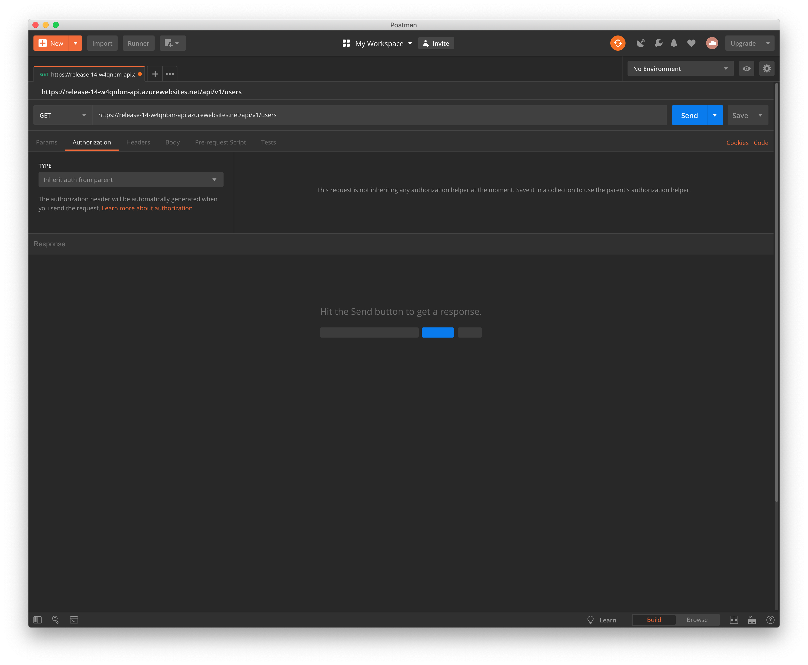
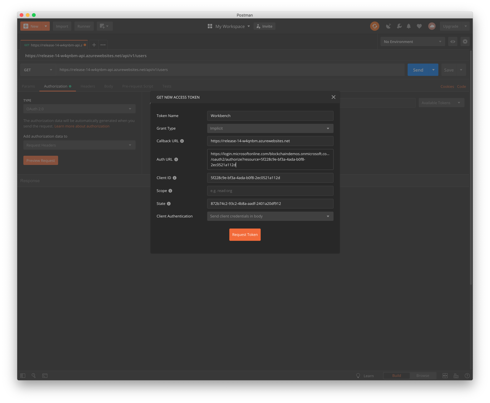
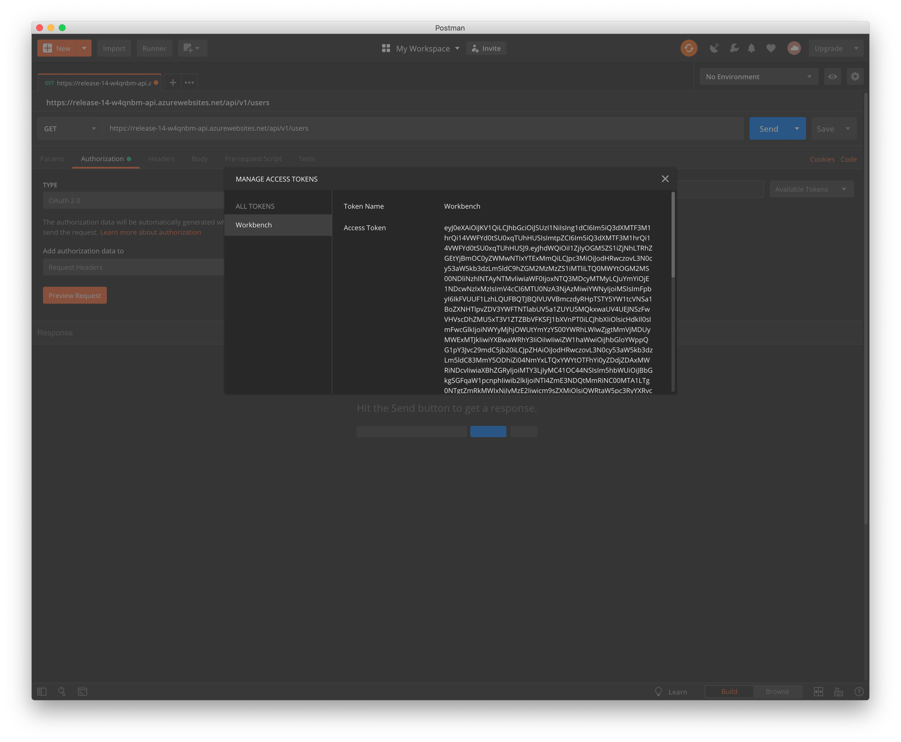
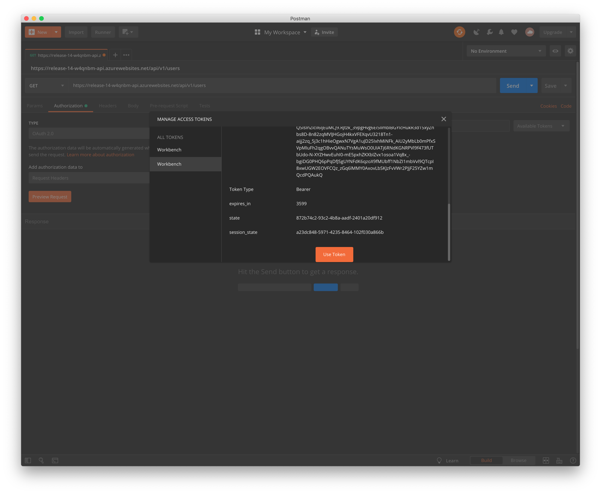
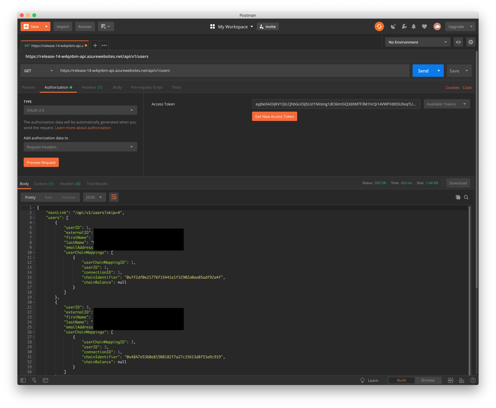

# Using Postman with your user credentials

## Overview
You can Postman's OAuth 2.0 authentication mechanism to obtain a bearer token by logging in using your user credentials. This is similar to how Workbench's UI obtains the bearer token, and the token will have the same claims as your user.

In this example we will walk you through how to obtain a bearer toke using your user credential and call the Workbench API.

## Instructions

1. Open Postman. You can download [Postman here](https://www.getpostman.com/downloads/).

In this example we are going to make a `GET` call to `/api/v1/users` to get all the users. Set the operation to `GET` and the url to `<workbench_url>/api/v1/users`

2. Navigate to the `Authorization` tab and pick `OAuth 2.0` from the dropdown menu. Then click on `Get New Access Token`

3. Now you need to set the following parameters:
  * Token Name: The name for your token
  * Grant Type: `Implicit`
  * Callback URL: The URL for Workbench WebApp
  * Auth URL: `https://login.microsoftonline.com/<tenant_name>/oauth2/authorize?resource=<workbench_app_id>`
  * Client id: Workbench's AppId
  * Scope: empty
  * State: A randomly generated GUID, you can use this [Online GUID Generator](https://www.guidgenerator.com/)
  * Client Authentication: `Send client credential in body`

Click on `Request Token`

4. You should be prompted for your user credential, after completing that step you will receive a bearer token.

5. Scroll down and click on `Use Token`

6. Click on send and you should get a list of users

