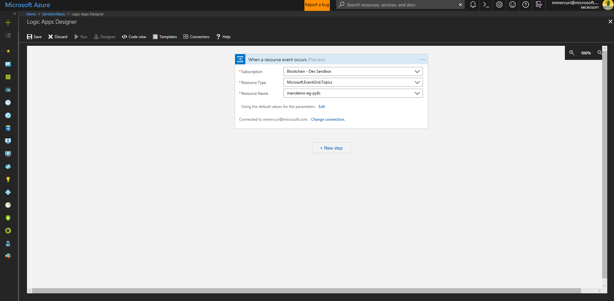
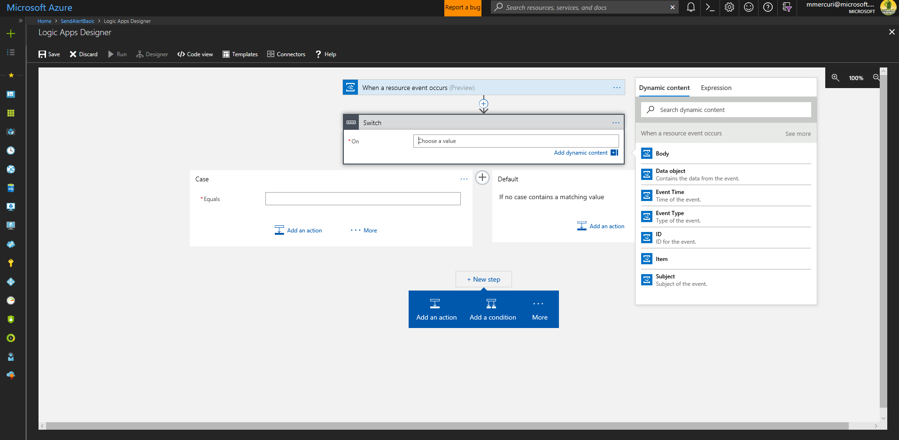

Create a Smart Contract in Azure Blockchain Workbench via Messaging 
====================================================================

Overview

This sample provides step by step instructions for setting up a logic app that can respond to events delivered from Azure Blockchain Workbench.

Create the Logic App
--------------------
Navigate to the Azure Portal at http://portal.azure.com 

Click the + symbol in the upper left corner of the screen to add a new resource

Search for and select Logic App and then click Create.

A logic app is initiated by a trigger. In this scenario, the trigger will be an event from Azure Blockchain Workbench delivered via the Event Grid.

Within the Logic App Designer select the trigger “When an Event Grid event
occurs”

Within the Logic App Designer, click the Sign In button.

Select the Azure Active Directory Tenant that the Event Grid was deployed to in
the drop-down list and either sign in or connect using a Service Principal. For
this basic sample, you will sign in using your credentials.

Clicking Sign In will display a login dialog.

Once connected successfully, the trigger will show a check mark in a green
circle as demonstrated below.

Click the Continue button.

Next select the subscription for the Azure Blockchain Workbench, specify a
Resource Type of “Microsoft.EventGrid.Topics” and the resource name for the
Event Grid topic in the resource group for the Azure Blockchain Workbench
deployment.

Click New Step

Click More and click the Add a Switch Case

For the Switch, there is an “On” configuration that identifies what value will
be reviewed.

Click the text box and then select “Subject” which contains the name of the
message type being delivered.

In the Case message on the right, enter the value of AccountCreated

Click the “…” in the upper right of the case and select Rename.

Rename the case to AccountCreated

For the action, select “Data Operations – Parse Json”

In the Content field select Body.

In the Schema field, enter the following –

{

"properties": {

"data": {

"properties": {

"ChainIdentifier": {

"type": "string"

},

"OperationName": {

"type": "string"

},

"RequestId": {

"type": "string"

},

"UserID": {

"type": "number"

}

},

"type": "object"

},

"dataVersion": {

"type": "string"

},

"eventTime": {

"type": "string"

},

"eventType": {

"type": "string"

},

"id": {

"type": "string"

},

"metadataVersion": {

"type": "string"

},

"subject": {

"type": "string"

},

"topic": {

"type": "string"

}

},

"type": "object"

}

Click on the + button in the middle of the screen to create the case for the
next message.

In the Case message on the right, enter the value of
AssignContractChainIdentifier

Click the “…” in the upper right of the case and select Rename.

Rename the case to AssignContractChainIdentifier

For the action, select “Data Operations – Parse Json”

In the Content field select Body.

In the Schema field, enter the following –

{

"properties": {

"data": {

"properties": {

"ChainIdentifier": {

"type": "string"

},

"ContractId": {

"type": "number"

},

"OperationName": {

"type": "string"

},

"RequestId": {

"type": "string"

}

},

"type": "object"

},

"dataVersion": {

"type": "string"

},

"eventTime": {

"type": "string"

},

"eventType": {

"type": "string"

},

"id": {

"type": "string"

},

"metadataVersion": {

"type": "string"

},

"subject": {

"type": "string"

},

"topic": {

"type": "string"

}

},

"type": "object"

}

Click on the + button in the middle of the screen to create the case for the
next message.

In the Case message on the right, enter the value of ContractInsertedOrUpdated

Click the “…” in the upper right of the case and select Rename.

Rename the case to ContractInsertedOrUpdated

For the action, select “Data Operations – Parse Json”

In the Content field select Body.

In the Schema field, enter the following –

{

"properties": {

"data": {

"properties": {

"ActionName": {

"type": "string"

},

"BlockId": {

"type": "number"

},

"ChainId": {

"type": "number"

},

"ContractAddress": {

"type": "string"

},

"ContractId": {

"type": "number"

},

"IsTopLevelUpdate": {

"type": "boolean"

},

"IsUpdate": {

"type": "boolean"

},

"OperationName": {

"type": "string"

},

"OriginatingAddress": {

"type": "string"

},

"Parameters": {

"items": {

"properties": {

"Name": {

"type": "string"

},

"Value": {

"type": "string"

}

},

"required": [

"Name",

"Value"

],

"type": "object"

},

"type": "array"

},

"TopLevelInputParams": {

"type": "array"

},

"TransactionHash": {

"type": "string"

}

},

"type": "object"

},

"dataVersion": {

"type": "string"

},

"eventTime": {

"type": "string"

},

"eventType": {

"type": "string"

},

"id": {

"type": "string"

},

"metadataVersion": {

"type": "string"

},

"subject": {

"type": "string"

},

"topic": {

"type": "string"

}

},

"type": "object"

}

Click on the + button in the middle of the screen to create the case for the
next message.

In the Case message on the right, enter the value of InsertBlock

Click the “…” in the upper right of the case and select Rename.

Rename the case to InsertBlock

For the action, select “Data Operations – Parse Json”

In the Content field select Body.

In the Schema field, enter the following –

{

"properties": {

"data": {

"properties": {

"BlockHash": {

"type": "string"

},

"BlockId": {

"type": "number"

},

"BlockTimestamp": {

"type": "number"

},

"ChainId": {

"type": "number"

},

"OperationName": {

"type": "string"

}

},

"type": "object"

},

"dataVersion": {

"type": "string"

},

"eventTime": {

"type": "string"

},

"eventType": {

"type": "string"

},

"id": {

"type": "string"

},

"metadataVersion": {

"type": "string"

},

"subject": {

"type": "string"

},

"topic": {

"type": "string"

}

},

"type": "object"

}

Click on the + button in the middle of the screen to create the case for the
next message.

In the Case message on the right, enter the value of InsertTransaction

Click the “…” in the upper right of the case and select Rename.

Rename the case to InsertTransaction

For the action, select “Data Operations – Parse Json”

In the Content field select Body.

In the Schema field, enter the following –

{

"properties": {

"data": {

"properties": {

"BlockId": {

"type": "number"

},

"ChainId": {

"type": "number"

},

"From": {

"type": "string"

},

"IsAppBuilderTx": {

"type": "boolean"

},

"OperationName": {

"type": "string"

},

"To": {},

"TransactionHash": {

"type": "string"

},

"Value": {

"type": "string"

}

},

"type": "object"

},

"dataVersion": {

"type": "string"

},

"eventTime": {

"type": "string"

},

"eventType": {

"type": "string"

},

"id": {

"type": "string"

},

"metadataVersion": {

"type": "string"

},

"subject": {

"type": "string"

},

"topic": {

"type": "string"

}

},

"type": "object"

}

Click on the + button in the middle of the screen to create the case for the
next message.

In the Case message on the right, enter the value of InsertTransaction

Click the “…” in the upper right of the case and select Rename.

Rename the case to InsertTransaction

For the action, select “Data Operations – Parse Json”

In the Content field select Body.

In the Schema field, enter the following –

Click on the + button in the middle of the screen to create the case for the
next message.

In the Case message on the right, enter the value of UpdateContractAction

Click the “…” in the upper right of the case and select Rename.

Rename the case to UpdateContractAction

For the action, select “Data Operations – Parse Json”

In the Content field select Body.

In the Schema field, enter the following –

{

"properties": {

"data": {

"properties": {

"BlockId": {

"type": "number"

},

"ChainId": {

"type": "number"

},

"From": {

"type": "string"

},

"IsAppBuilderTx": {

"type": "boolean"

},

"OperationName": {

"type": "string"

},

"To": {},

"TransactionHash": {

"type": "string"

},

"Value": {

"type": "string"

}

},

"type": "object"

},

"dataVersion": {

"type": "string"

},

"eventTime": {

"type": "string"

},

"eventType": {

"type": "string"

},

"id": {

"type": "string"

},

"metadataVersion": {

"type": "string"

},

"subject": {

"type": "string"

},

"topic": {

"type": "string"

}

},

"type": "object"

}
